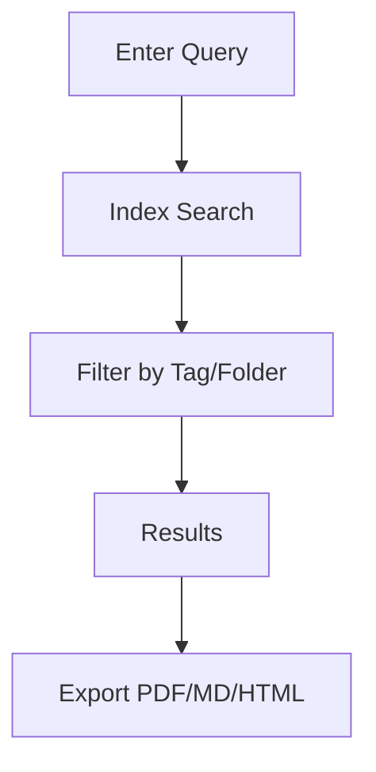

## Overview

A F provides powerful tools to streamline your documentation workflow. You organize content hierarchically, track changes with version control, collaborate seamlessly with teams, and access advanced search and export functions. These features ensure your project docs stay current and accessible.

<Columns cols={2}>
  <Card title="Organization Tools" icon="folder" href="#document-organization">
    Structure your docs with folders and tags for easy navigation.
  </Card>
  <Card title="Version Control" icon="git-branch" href="#version-control">
    Track changes and revert to previous versions effortlessly.
  </Card>
  <Card title="Collaboration" icon="users" href="#collaboration">
    Invite team members and manage permissions.
  </Card>
  <Card title="Search & Export" icon="search" href="#search-export">
    Find content quickly and export in multiple formats.
  </Card>
</Columns>

## Document Organization Tools

Organize your documentation using folders, tags, and custom hierarchies. Create nested structures to mirror your project architecture, making it simple to locate files.

<Steps>
  <Step title="Create a Folder" icon="folder-plus">
    Navigate to your workspace and select **New Folder**. Name it based on your project module, such as `api-reference`.
  </Step>
  <Step title="Add Tags" icon="tag">
    Open a document, click **Tags**, and add labels like `v1.0` or `internal`.
  </Step>
  <Step title="Rearrange Structure" icon="move">
    Drag and drop files or folders to reorder your hierarchy.
  </Step>
</Steps>

<Callout kind="tip">
  Use consistent naming conventions like `{module}-{version}` for folders to maintain clarity across teams.
</Callout>

## Version Control for Docs

A F integrates version control directly into your workflow. You commit changes, view diffs, and rollback as needed, similar to Git but optimized for docs.

<CodeGroup tabs="CLI,API">
  ```bash
  # Commit changes via CLI
  af commit -m "Update API endpoints" --tag v2.0.1
  af push origin main
  ```
  ```javascript
  // Commit via API
  const response = await fetch('https://api.example.com/v1/docs/commit', {
    method: 'POST',
    headers: { 'Authorization': `Bearer ${YOUR_API_KEY}` },
    body: JSON.stringify({
      message: 'Update API endpoints',
      tag: 'v2.0.1'
    })
  });
  ```
</CodeGroup>

View history in the UI by selecting **Versions** on any document.

## Collaboration Features

Invite teammates and assign roles to control access. Real-time editing and comments keep everyone aligned.

<Tabs>
  <Tab title="Editor Role" icon="edit-3">
    Editors can modify content and approve changes.

    <ParamField path="userId" param-type="string" required="true">
      Unique user identifier for invitations.
    </ParamField>
  </Tab>
  <Tab title="Viewer Role" icon="eye">
    Viewers access docs without edit permissions.
  </Tab>
  <Tab title="Admin Role" icon="shield">
    Admins manage users and workspaces.
  </Tab>
</Tabs>

## Search and Export Options

Search across all docs with full-text indexing. Export to PDF, Markdown, or HTML for sharing.



<CodeGroup tabs="Search API,Export CLI">
  ```javascript
  // Search via API
  const results = await fetch('https://api.example.com/v1/search?q=authentication', {
    headers: { 'Authorization': `Bearer ${YOUR_API_KEY}` }
  });
  ```
  ```bash
  # Export workspace
  af export --format pdf --output ./docs.pdf --include-tags "public"
  ```
</CodeGroup>

<Expandable title="Advanced Search Filters" default-open="false">
  Combine queries like `authentication AND v2.0` with filters for folders or dates.
</Expandable>

<Callout kind="success">
  Start with organization tools to build a strong foundation, then layer on collaboration for team projects.
</Callout>