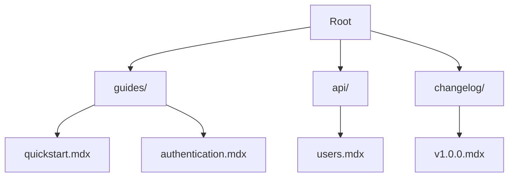

## Overview

Organize your A F documentation effectively to ensure clarity, scalability, and collaboration. This guide covers folder hierarchies, editing best practices, permissions, and backup strategies. Follow these techniques to maintain professional, up-to-date docs.

<Columns cols={3}>
  <Card title="Hierarchy Setup" icon="folder" href="#hierarchy">
    Structure your content logically.
  </Card>
  <Card title="Editing Guidelines" icon="edit-3" href="#editing">
    Format consistently across pages.
  </Card>
  <Card title="Permissions" icon="shield" href="#permissions">
    Control access securely.
  </Card>
</Columns>

## Folder and Page Hierarchy Setup

Build a clear hierarchy to improve navigation. Start with top-level folders like `guides/`, `api/`, and `changelog/`. Nest pages logically: `guides/quickstart.mdx`, `api/endpoints/users.mdx`.

<Steps>
  <Step title="Plan Your Structure" icon="map">
    Identify main categories: user guides, API references, FAQs.

    List subtopics under each.

  </Step>
  <Step title="Create Folders" icon="folder-plus">
    In A F dashboard, create folders via the file manager.

    Use lowercase with hyphens: `user-authentication/`.

  </Step>
  <Step title="Add Pages" icon="file-plus">
    Create `.mdx` files in relevant folders.

    Set frontmatter titles for navigation.

  </Step>
</Steps>



## Editing and Formatting Guidelines

Maintain consistency with MDX standards. Use H2 for sections, escape special characters like `{variable}` with backticks, and leverage components.

<Tabs>
  <Tab title="Headings & Text" icon="type">
    Always start with ## H2. Escape `<100ms` as `<100ms`.

    ```markdown
    ## Section Title

    Use **bold** and _italic_.
    ```
  </Tab>
  <Tab title="Code Examples" icon="code">
    Use fenced blocks with language tags.

    <CodeGroup tabs="JavaScript,Python">
    ````javascript
    const apiKey = 'YOUR_API_KEY';
    fetch('https://api.example.com/users');
    ````
    ````python
    import requests
    response = requests.get('https://api.example.com/users')
    ````
    </CodeGroup>
  </Tab>
</Tabs>

<Callout kind="tip">
  Validate MDX syntax before saving to avoid parsing errors.
</Callout>

## Access Permissions and Sharing

Control who edits your docs. A F offers role-based access: Owner, Editor, Viewer.

| Role     | Edit Pages | Manage Permissions | Export Docs |
|----------|------------|--------------------|-------------|
| Owner    | Yes       | Yes                | Yes         |
| Editor   | Yes       | No                 | Yes         |
| Viewer   | No        | No                 | No          |

<Expandable title="Advanced Permissions" default-open="false">
  Use team groups for projects. Assign via dashboard > Settings > Collaborators.
</Expandable>

## Backup and Export Strategies

Prevent data loss with regular backups. Export to Markdown or PDF.

<Steps>
  <Step title="Enable Version History" icon="git-branch">
    A F auto-saves versions. Access via page history.
  </Step>
  <Step title="Export Project" icon="download">
    Go to Project Settings > Export > Select format (ZIP, GitHub).
  </Step>
  <Step title="Automate Backups" icon="clock">
    Integrate with GitHub: Connect repo and push changes automatically.
  </Step>
</Steps>

<Callout kind="alert">
  Export weekly and store in secure locations like `https://dashboard.example.com/backups`.
</Callout>

Follow these practices to keep your A F documentation scalable and collaborative. For more, explore [quickstart](/quickstart).